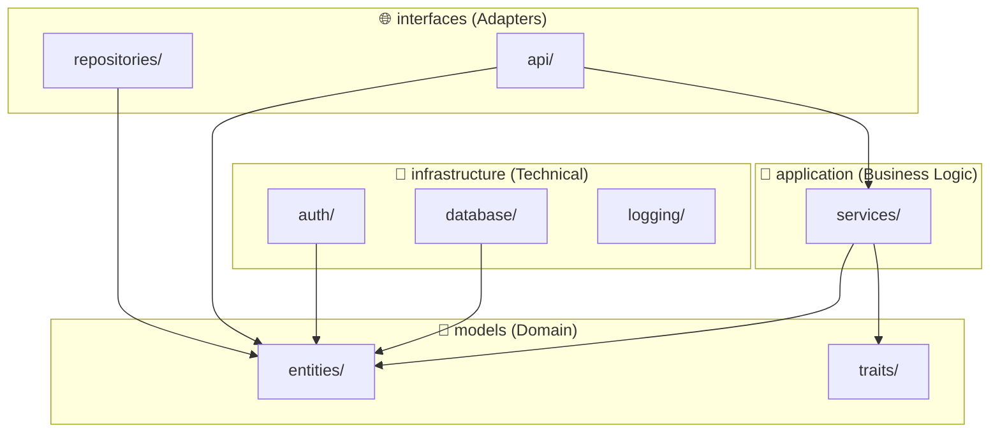

# 🏛️ Architecture Analysis - Chasqui Server

## 📋 Executive Summary
The project follows **Clean Architecture** principles with a solid and well-organized structure. While there are opportunities for further modularity, the current architecture is robust and sufficient for implementing advanced features like the chat system.

**Overall Rating: 8/10** ✅

---

## ✅ Current Strengths

### 1. Clear Layer Separation
```text
src/
├── models/          ✅ Domain Layer (Entities + Traits)
├── application/     ✅ Use Cases / Business Logic
├── infrastructure/  ✅ Technical Details (DB, Auth, Logging)
└── interfaces/      ✅ Adapters (API + Repositories)
```

### 2. Dependency Flow


*   `models`: Core domain, no external dependencies.
*   `application`: Depends only on `models`.
*   `infrastructure`: Implements technical details.
*   `interfaces`: Connects everything to the outside world.

---

## 🟡 Areas for Future Improvement

1.  **Interface Granularity:** `interfaces/` currently mixes HTTP handlers and Repositories. In a stricter "Clean" setup, Repositories would move to `infrastructure`.
2.  **Explicit DTOs:** Explicitly separating Request/Response types from Domain Entities to improve versioning and data control.
3.  **Infrastructure Modularity:** Further dividing `infrastructure/` into specialized sub-modules (websocket, cache, messaging).

---

## 🎯 Chat Implementation Strategy

The project adopted **Option A: Pragmatic Evolution**.

*   **Decision:** Maintain the current structure for the chat implementation.
*   **Rationale:** It's consistent with existing patterns, avoids premature refactoring, and is highly efficient for the current scale.
*   **Principle:** "Do → Learn → Improve".

---

## 🎓 Guiding Principles
1.  **YAGNI (You Aren't Gonna Need It):** Don't add complexity until required.
2.  **KISS (Keep It Simple, Stupid):** Simplicity > Theoretical Perfection.
3.  **Pragmatism over Purism:** A working, "good enough" architecture is better than a complex "perfect" one that blocks development.
